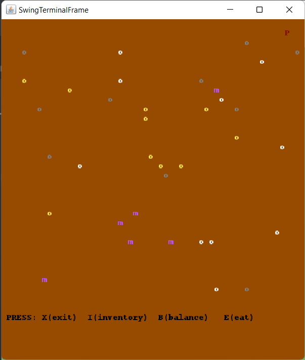
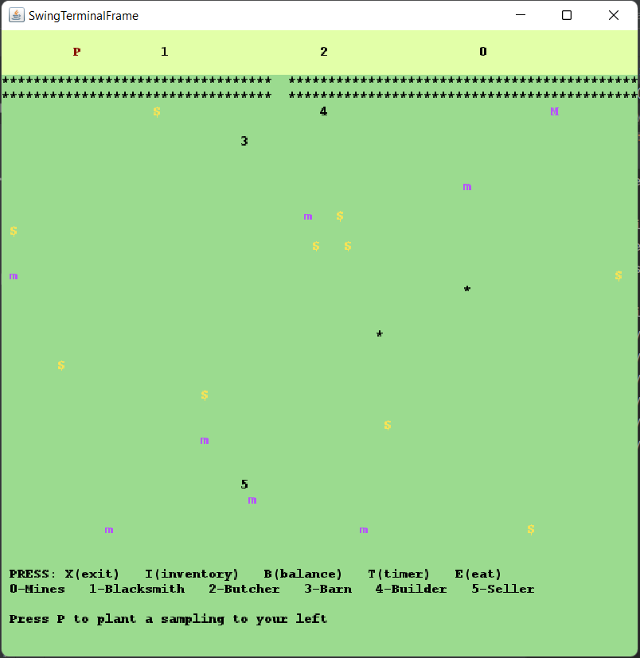
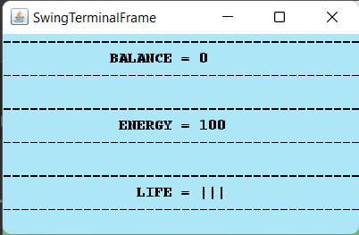

## LDTS_T12_G06 - STARDEW VALLEY

STARDEW VALLEY is a RPG game where you need to collect resources and move through various places in order to survive the longest time possible.
You can do that by buying items from NPCs, evading monsters and collecting coins all through your world

This project was developed by Bárbara Filipa da Silva Carvalho 'up202004695@fe.up.pt', Luís Tiago Trindade Cabral 'up202006464@fe.up.pt' and Maria Sofia Brandão Porto Carvalho Gonçalves 'up202006927@fe.up.pt'

### IMPLEMENTED FEATURES

- **Death** - If the player runs out of lives, he dies.
- **Timer** - The player can keep track of the in-game clock, by pressing the letter 't'.
- **In-Game Clock** - The game has a twenty-four hour clock, that is initiated at 9:00, that is updated every time period.
- **Collect Coins** - The player can collect coins, that automatically increase the balance available to the player.
- **Collect Minerals** - The player can collect minerals, in the mine, that get automatically added to the inventory.
- **Connected Places** - The player can browse freely between different places like the main world, the Butcher, the Barn, the BlackSmith, the Builder, the Seller and the Mines.
- **Collision Detection** - All collisions are dettected (Player/Player, Player/Monster, Monster/Monster, Player/Wall, Monster/Wall, Player/Coin, Player/Mineral).
- **Interact with NPCs** - The user can have interactions with NPCs, in their specifically houses, like buying an item, selling an item or crafting an item.
- **Type-Based Monsters** - The monsters can be of two different types: Aimless, or Stalkers. The Aimless ones move freely through the map, without taking into account the current position of the player. The Stalker Monsters move accordingly to the player's current position, taking the right steps in order to be the closest possible to the player.
- **Fight Systems** - The player can enter fights with monsters, by having a damage-giving tool in the inventory. The fight ends when: the player runs out of tools in the inventory, losing a life / the monster runs out of health points. If the player loses a life, he is able to flee the fight, by moving away from the monster, if an aimless one. If the monster runs out of health points, he, evidently, dies. Every tool is capable of landing one hit, disappearing after the hit is landed.
- **Fight Fleeability** - The player can flee every fight, by pressing 'x' when in contact with a monster, being able to run away from it to a SafeZone. 
- **Items Craftability** - The player is able to craft items in The Builder interface, by combining different items into one.
- **Item Market** - The player is able to buy or sell items in, either one of the three different shops ("The Barn" / "The Butcher" / "The BlackSmith") [Where he can buy different items], or The Seller [Where he can sell his items].
- **Item Droppability** - Some entities, when interacted with, drop different items. For exemple, the trees, when broken, drop a sapling, used to plant another tree, and a variable number of wood.
- **Safe Zone** - In the game, there are SafeZones, (zones where no Monsters are allowed in). One of these zones is the one at the top of the main map (with a different color), and every NPC Shop.
- **Sound System** - In the game, every single entity has a sound associated to. For example, every monster emmits a sound when it dies, every tree emmits a sound when planted, and every collision of the player with the walls emmits a sound. [The Main Song (the one that plays at the start of every new game), is actually the same as the one in StardewValley!].
- **Money Management** - The player has a balance associated to him, which he can use pratially, or totally, to make in-game transactions.
- **Energy Bar** - The player as an energy bar associated to, that gradually decreases with every movement. In order to fill this energy bar, the player has to eat.
- **Lives Bar** - The player as a life bar associated to, that begins with tree lines, decreasing every time the player loses a life.
- **Eating System** - The player is able to eat some of the items in the inventory, in order to fill the energy bar.
- **Intrinsic values of an item** - Every item has some intrinsic values. All items have a price associated to them, this being the price they can sell, or buy it for. If the item is classified as "Food", the other intrinsic value is the energy given to the player, when eaten. If the item is classified as "Tools", the other intrinsic value is the damage given to the monster, when hit with.
- **Tree Plantability** - The player can plant trees freely in the main map, by pressing 'p', if there is at least one sapling in the inventory.
- **Game Loseability** - The player loses when all three lives are lost.
- **Game Quit** - The player can freely quit the game, by pressing 'x' in the main map, losing all progress.

Figure 1 - Timer

Figure 2 - Mine

Figure 3 - Inventory with stuff

Figure 4 - NPC

Figure 5 - Selling items

Figure 6 - Final Map

Figure 7 - NPC (butcher) selling products

Figure 8 - Balance/Energy/Timer

### PLANNED FEATURES

- **Monsters time-based movement** - The monsters will move after a span of time, instead of moving on a turn-based system.
- **Constant Timer** - Although the timer is being updated whether or not the player is in the main map, or one of the other maps, it is not accessible in any map other than the initial one.

These features would have been implemented in the future if we had had te opportunity to do so.

### DESIGN

**The Patterns**

-[ClassUML](classdiagrammvc.puml)

**Composite**

We have applied the Composite design pattern. Compose objects into tree structures to represent part-whole hierarchies. This pattern allowed to address the identified problem because it allows to only write the method one time and be used by many different classes through hierarchy.
The different types of shops (Barn, Blacksmith, Builder, Butcher and Seller) and the "main class" (House) are an example of this implementation:

-[Barn](../src/main/java/g1206.Barn.java);

-[Blacksmith](../src/main/java/g1206.Blacksmith.java);

-[Builder](../src/main/java/g1206.Builder.java);

-[Butcher](../src/main/java/g1206.Butcher.java);

-[Seller](../src/main/java/g1206.Seller.java);

-[House](../src/main/java/g1206.House.java);

-[CompositeUML](composite.puml)

Consequences:

This makes easier the code easier to write and understand because allows treating individual objects and compositions of objects, or “composites” in the same way.

**Factory Method and Abstract Class**

The class Monster is abstract. In the Map class, 2 different types of monsters are created - Aimless (do not have any specific aim, do not chase the player, move without a predefined direction) and the Stalkers (chase the player, eventually going against him).

-[Map](../src/main/java/g1206.Map.java);

-[FactoryMethodUML](factorymethod.puml)

Consequences:

Instead of having to call the same methods to the two different types of Monster, because we created the abstract class, they are already implemented in both the Stalker and Aimless class (not having to repeat them in each class).

**State**

The Tree varies according to its state during runtime: when it is planted, it cannot be cut, giving neither sampling nor wood, until it reaches "adulthood" (which happens at the end of a certain number of user inputs - there is a time passing simulation).

-[Tree](../src/main/java/g1206.Tree.java);

Consequences:

Because what a tree does depends on its context (if it's fully grown or not), using this pattern allows objects to change their behaviour based on their current state.

#### KNOWN CODE SMELLS AND REFACTORING SUGGESTIONS THAT WERE IMPLEMENTED

**Long Method**

Some of our functions have too many lines. In some cases, downsizing the number of lines written is very difficult, so we we not able to do it (eg.: the function retrieveTree() in the class [Map](../src/main/java/g1206.Map.java)).

Refactoring done:

In other cases, we were able to reduce the number of lines. 
Example: We created two different functions to create separately the two different kinds of Monster in the beggining of the game - createAimless() e createStalker() in class [Map](../src/main/java/g1206.Map.java) - instead of writing all of it in the same function. This way, it was easier to detect little bugs that we had.

**Large Class**

We had the five different stores in the class House. 

Refactoring done:

We had a huge class with all of them, but then we chose to make it abstract and create 5 different child classes ([Barn](../src/main/java/g1206.Barn.java), [Blacksmith](../src/main/java/g1206.Blacksmith.java), [Builder](../src/main/java/g1206.Builder.java), [Butcher](../src/main/java/g1206.Butcher.java), [Seller](../src/main/java/g1206.Seller.java))

**Duplicate Code**

The code used in moveStalkers() (in the class [Map](../src/main/java/g1206.Map.java)) is pretty repetitive. A better solution to find where the Aimless monsters should move to based on the player's position. 

Refactoring done:

We did not have time to refactor this code smell. We would have made it more efficient (less repetitive).

### TESTING

Some tests were implemented and then had to be ignored because they did not allow the correct operation of PIT, so they were excluded from PIT reach.

### SELF-EVALUATION

All group elements collaborated in the project in an equal effort.