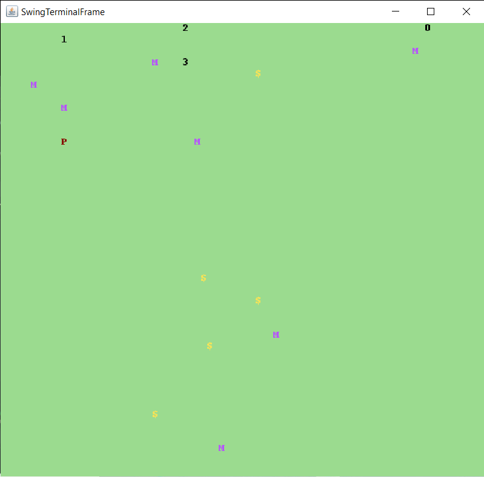
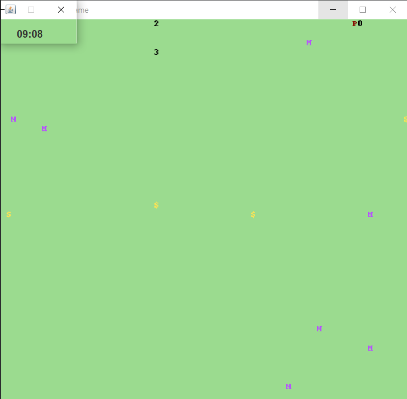
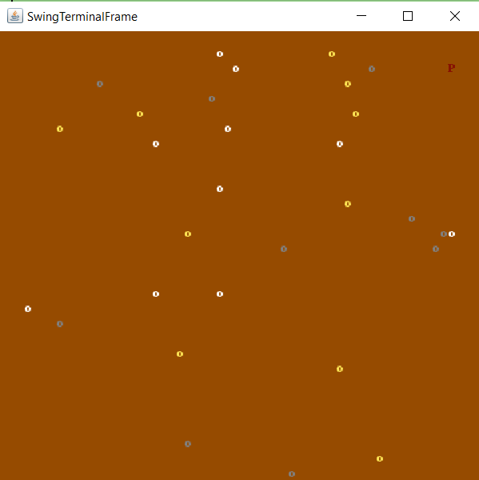
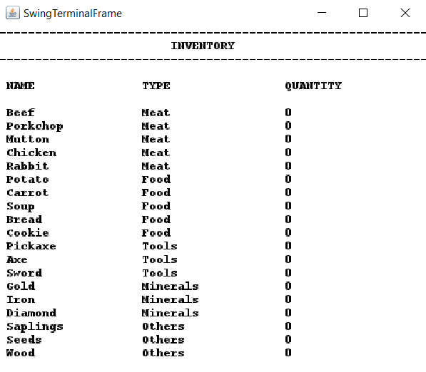
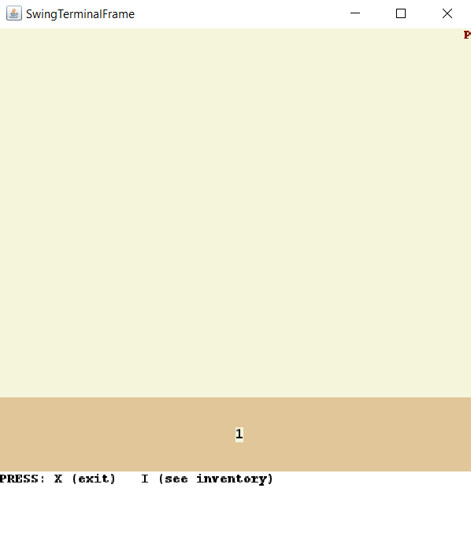
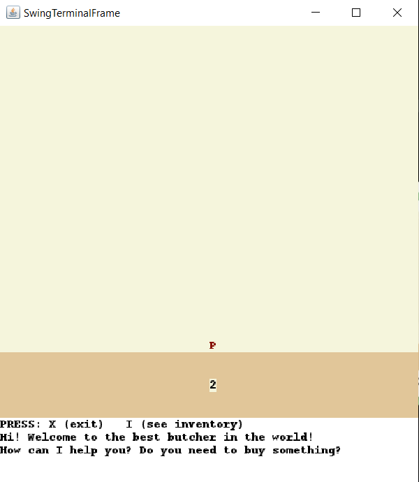
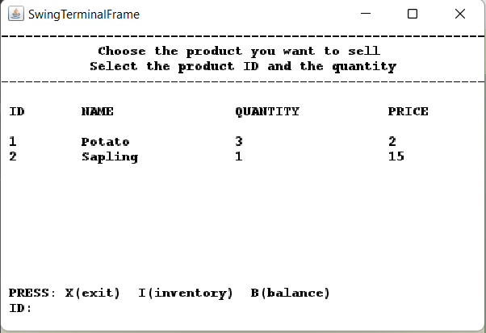
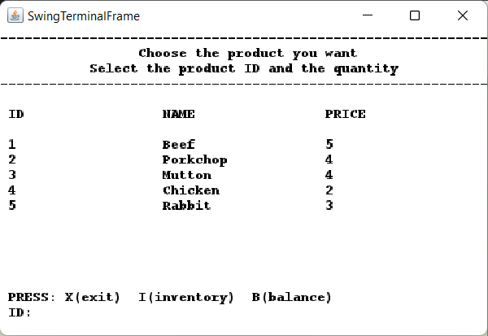
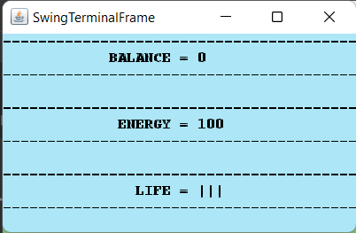
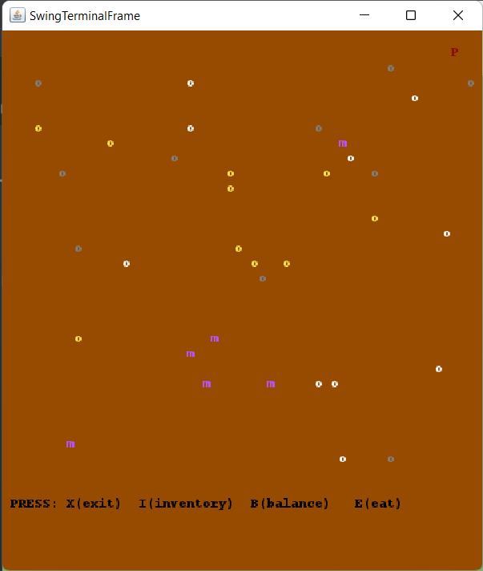

## LDTS_T12_G06 - STARDEW VALLEY

STARDEW VALLEY is a RPG game where you need to collect resources and move through various places in order to survive the longest time possible. 
You can do that by buying items from NPCs, evading monsters and collecting coins all through your world

This project was developed by Bárbara Filipa da Silva Carvalho 'up202004695@fe.up.pt', Luís Tiago Trindade Cabral 'up202006464@fe.up.pt' and Maria Sofia Brandão Porto Carvalho Gonçalves 'up202006927@fe.up.pt'

If you want to read a more detailed version of our work, [here](.docs\report\readme.md).

The following screenshots illustrate the look of our game, and the divergent functionalities (first submission):

The following functionalities were then implemented:

